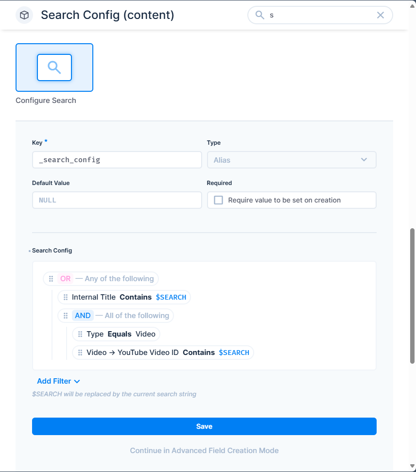

# Search Configuration for Directus

Provides a way to configure the Directus search filters for a collection. This allows you to supercharge your Directus `search` field with AND/OR groups, strict equality, case-insensitive searches, nested relational searches, and named filter presets - fully under your control.

# Installation

This plugin has not yet been published on NPM, but you can try installing it directly from GitHub.

# Usage

## Basic Setup

1. Add a new field in the collection you wish to add search configuration for.

2. Assign the `Configure Search` interface to the field.

3. Configure your filter using the `system-filter` interface options.

## Placeholders

The following placeholders are supported in your search filter configuration:

| Placeholder | Description | Example |
|-------------|-------------|---------|
| `$SEARCH` | Raw search term | `widget` → `widget` |
| `$SEARCH_LOWERCASE` | Lowercased search term | `Widget` → `widget` |
| `$SEARCH_UPPERCASE` | Uppercased search term | `widget` → `WIDGET` |
| `$SEARCH_WILDCARD` | Wrapped with wildcards | `widget` → `*widget*` |

## Filter Presets

Define named filters that can be activated via the `filters` query parameter. This is especially useful for the relationship picker drawer where bookmarks are not available.

### Adding Presets

In the `Configure Search` interface, scroll to the "Filter Presets" section:

1. Click **Add Preset**
2. Fill in the details:
   - **Slug**: URL-safe identifier (e.g., `active`, `this-week`)
   - **Name**: Display name (e.g., "Active Items", "This Week")
   - **Icon**: Choose an icon from the dropdown
   - **Filter**: Define the Directus filter using the filter builder

### Using Presets

Activate presets by passing the `filters` query parameter with comma-separated slugs:

```
GET /items/collection?search=term&filters=active,this-week
```

Multiple presets are combined with AND logic. Unknown preset slugs are ignored silently.

## Custom Field Name

By default, the extension looks for a field named `_search_config`. You can customize this in the interface options by setting the "Config Field Name" option.

## Example Configuration

```json
{
  "search_config": {
    "_and": [
      { "status": { "_eq": "published" } },
      { "deleted_at": { "_null": true } }
    ]
  },
  "presets": [
    {
      "slug": "active",
      "name": "Active",
      "icon": "check",
      "filter": { "status": { "_eq": "active" } }
    },
    {
      "slug": "this-week",
      "name": "This Week",
      "icon": "calendar",
      "filter": { "created_at": { "_gte": "$NOW - 7 days" } }
    }
  ]
}
```

Search the collection. Both app and API searches will now use the filter pattern you've specified. You can use nested relational fields for the search.

